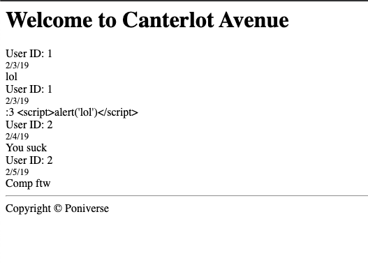

# Canterlot Avenue Dev Candidate Assessment

# 2. CSS Styles Assessment

Obviously this main page is not exciting. Let's give it some style!

Check out `Apps/Core/Views/indexmember.php` and add some CSS styles.

The main page contains a list of comments. The following CSS classes are used.

- `comment` - The encompassing class for a commeent element
- `comment_user` - The posting user
- `comment_time` - When the comment was posted
- `comment_text` - The text of the comment